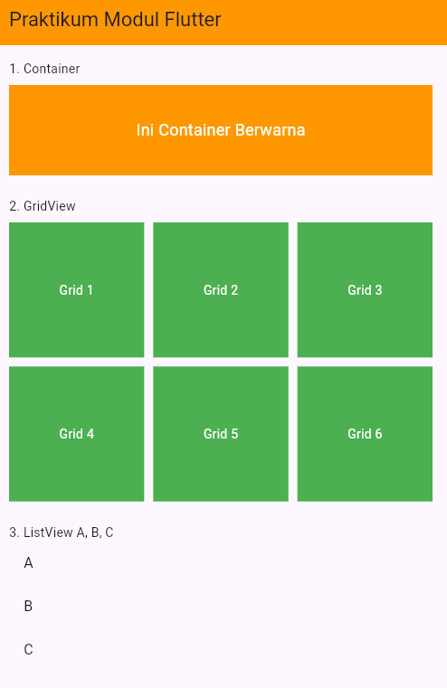
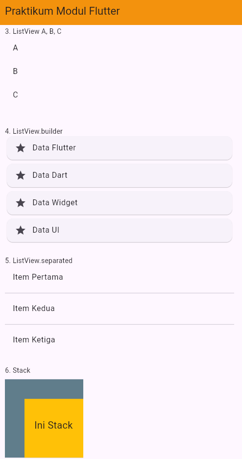

# Tugas Praktikum Pertemuan 7 Modul Flutter

Project ini dibuat untuk menampilkan beberapa widget dasar pada Flutter.

## Widget yang Digunakan

1. **Container**  
   Digunakan untuk membuat kotak berwarna dengan teks di tengah.

2. **GridView**  
   Digunakan untuk menampilkan 6 item dalam bentuk grid.

3. **ListView**  
   Digunakan untuk menampilkan 3 item yaitu A, B, dan C.

4. **ListView.builder**  
   Digunakan untuk menampilkan list berdasarkan data array.

5. **ListView.separated**  
   Digunakan untuk menampilkan list dengan garis pembatas antar item.

6. **Stack**  
   Digunakan untuk membuat tampilan bertumpuk antara kotak dan teks.

## Screenshot Hasil

  

  

