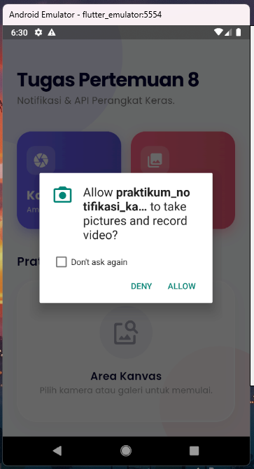
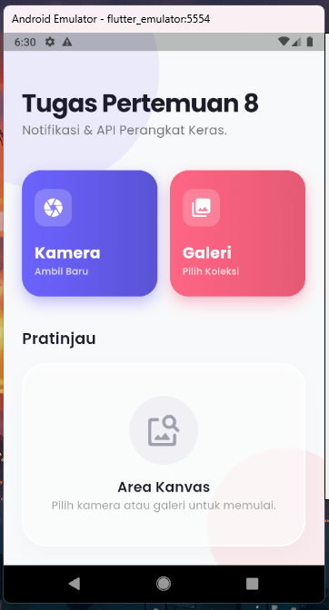
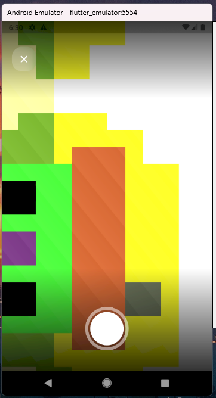
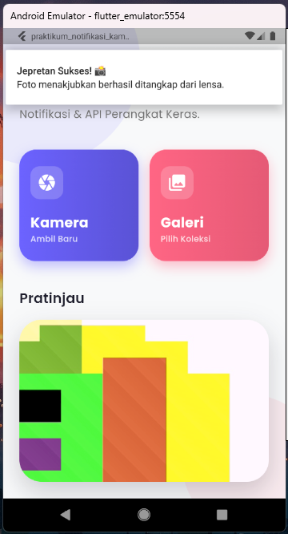
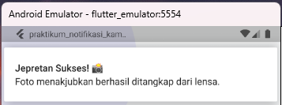

# Praktikum Notifikasi & API Perangkat Keras

Aplikasi Flutter sederhana untuk mengambil foto menggunakan Camera API, memilih foto dari galeri menggunakan image_picker, dan menampilkan notifikasi lokal menggunakan flutter_local_notifications.

## Fitur
- Buka kamera langsung
- Pilih foto dari galeri
- Menampilkan foto di halaman utama
- Menampilkan notifikasi setelah foto berhasil diambil atau dipilih

## Package yang Digunakan
- camera
- image_picker
- flutter_local_notifications
- permission_handler

## Penjelasan Widget
1. MaterialApp: root aplikasi Flutter.
2. Scaffold: struktur halaman utama.
3. AppBar: menampilkan judul aplikasi.
4. ElevatedButton.icon: tombol kamera dan galeri.
5. Container: tempat menampilkan foto.
6. Image.file: menampilkan foto dari file lokal.
7. CameraPreview: menampilkan preview kamera.
8. FloatingActionButton: tombol mengambil foto.

## Screenshot

*(Simpan file screenshot Anda di dalam folder `screenshots` dengan nama yang sesuai di bawah ini agar gambar otomatis muncul di Markdown)*

### 1. Izin Aplikasi (Permissions)

### 2. Halaman Utama

### 3. Kamera

### 4. Hasil Foto & Notifikasi

### 5. Hasil Notifikasi

