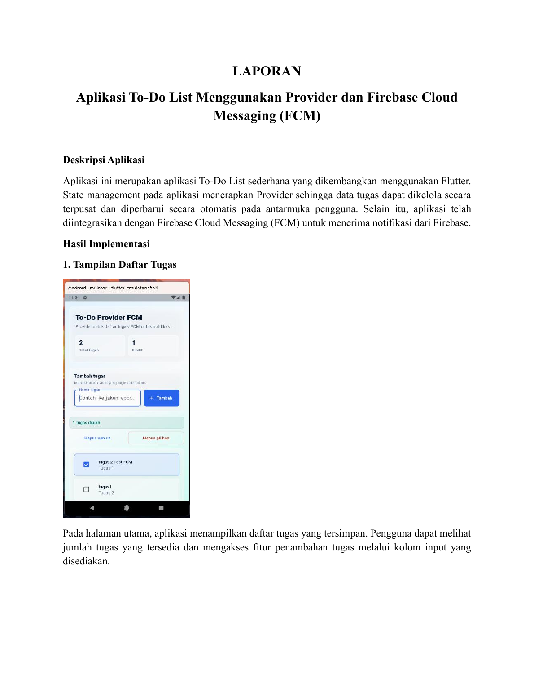
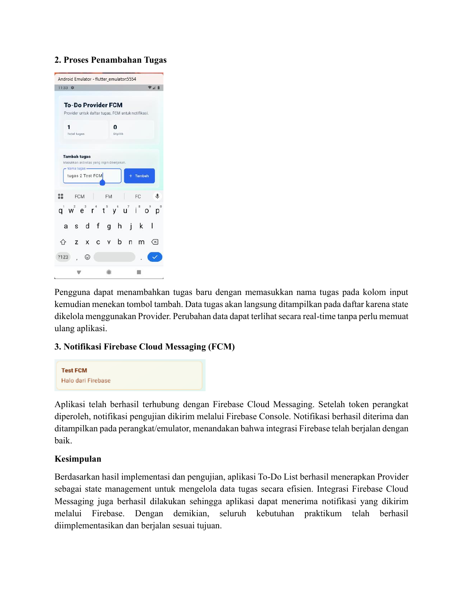

# To-Do Provider FCM

Aplikasi Flutter sederhana untuk praktikum Provider dan Firebase Cloud Messaging.

## Laporan

[Lihat file PDF laporan](laporan%20Pertemuan%209%20dan%2010.pdf)

## Fitur

- Menampilkan daftar tugas sederhana.
- Menambah tugas menggunakan state management Provider.
- Memilih tugas dengan checkbox.
- Menghapus tugas yang dipilih.
- Menghapus seluruh tugas.
- Menampilkan status Firebase Cloud Messaging.
- Menampilkan token FCM dan notifikasi terakhir yang diterima.

## Hasil Screenshot

### 1. Tampilan Daftar Tugas

### 2. Proses Penambahan Tugas

### 3. Notifikasi FCM Berhasil Diterima

