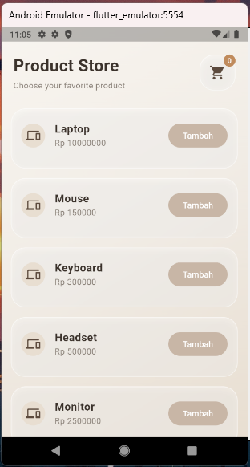
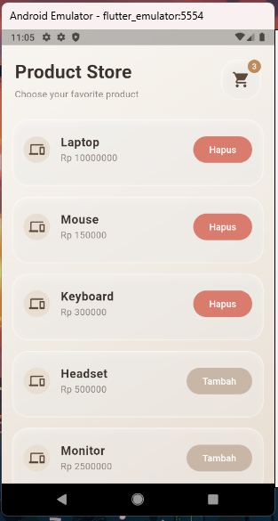
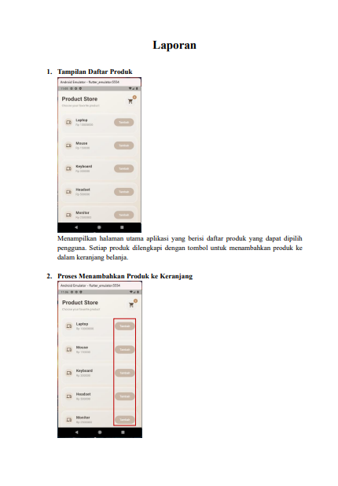
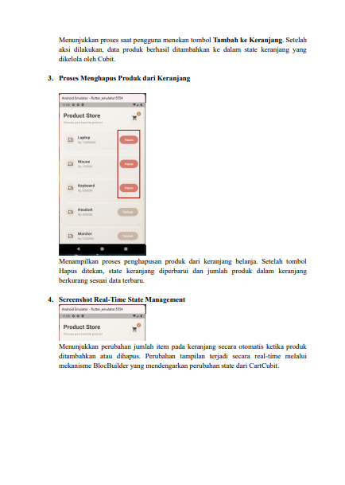

# Praktikum BLoC Flutter - Aplikasi Keranjang Belanja

## Deskripsi

Aplikasi ini merupakan implementasi sederhana State Management menggunakan **Flutter BLoC (Cubit)**. Aplikasi menampilkan daftar produk dan memungkinkan pengguna menambahkan maupun menghapus produk dari keranjang belanja secara real-time.

## Fitur

* Menampilkan daftar produk.
* Menambahkan produk ke keranjang.
* Menghapus produk dari keranjang.
* Perhitungan jumlah item keranjang secara otomatis.
* State management menggunakan Flutter BLoC (Cubit).
* Update data secara real-time tanpa refresh halaman.

## Teknologi yang Digunakan

* Flutter
* Dart
* flutter_bloc
* Cubit

## Struktur Proyek

```text
lib/
├── main.dart
├── home_page.dart
├── cart_cubit.dart
├── cart_state.dart
└── product.dart
```

## Hasil Aplikasi
## Hasil 1

## Hasil 2


## Laporan


## .


## Cara Menjalankan

1. Clone repository.

```bash
git clone <repository-url>
```

2. Masuk ke folder project.

```bash
cd praktikum_bloc
```

3. Install dependency.

```bash
flutter pub get
```

4. Jalankan aplikasi.

```bash
flutter run
```

## Hasil

Implementasi Flutter BLoC (Cubit) berhasil digunakan untuk mengelola state keranjang belanja. Setiap perubahan data pada keranjang langsung diperbarui pada antarmuka secara real-time sehingga aplikasi menjadi lebih terstruktur dan mudah dikembangkan.
